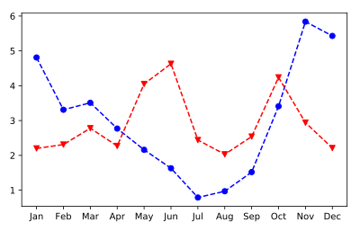

## Customizing data appearance

We can customize the appearance of data in our plots, while adding the data to the plot, using key-word arguments to the plot command.

In this exercise, you will customize the appearance of the markers, the linestyle that is used, and the color of the lines and markers for your data.

As before, the data is already provided in Pandas DataFrame objects loaded into memory: `seattle_weather` and `austin_weather`. These each have a `MONTHS` column and a "MLY-PRCP-NORMAL" that you will plot against each other.

In addition, a Figure object named `fig` and an Axes object named `ax` have already been created for you.

**Instructions**

* Call `plt.plot` to plot "MLY-PRCP-NORMAL" against "MONTHS" in both DataFrames.
* Pass the `color` key-word arguments to these commands to set the color of the Seattle data to blue ('b') and the Austin data to red ('r').
* Pass the `marker` key-word arguments to these commands to set the Seattle data to circle markers ('o') and the Austin markers to triangles pointing downwards ('v').
* Pass the `linestyle` key-word argument to use dashed lines for the data from both cities ('--').

## script.py
```
# Plot Seattle data, setting data appearance
ax.plot(seattle_weather["MONTH"], seattle_weather["MLY-PRCP-NORMAL"], color='b', marker='o', linestyle='--')

# Plot Austin data, setting data appearance
ax.plot(austin_weather["MONTH"], austin_weather["MLY-PRCP-NORMAL"], color='r', marker='v', linestyle='--')

# Call show to display the resulting plot
plt.show()
```

## Output
