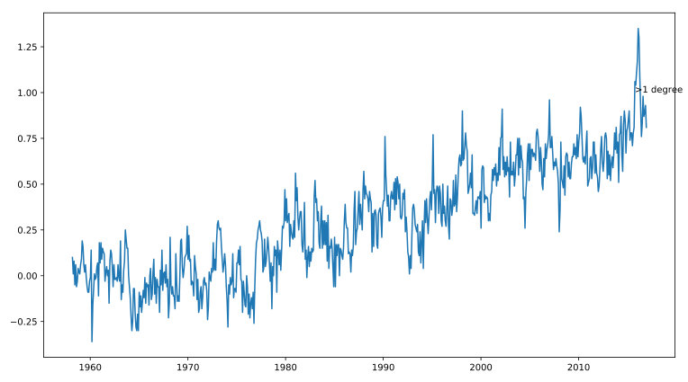

Annotating a plot of time-series data

Annotating a plot allows us to highlight interesting information in the plot. For example, in describing the climate change dataset, we might want to point to the date at which the relative temperature first exceeded 1 degree Celsius.

For this, we will use the `annotate` method of the Axes object. In this exercise, you will have the `DataFrame` called `climate_change` loaded into memory. Using the Axes methods, plot only the relative temperature column as a function of dates, and annotate the data.

**Instructions**

* Use the `ax.plot` method to plot the DataFrame index against the `relative_temp` column.
* Use the `annotate` method to add the text `'>1 degree'` in the location `(pd.Timestamp('2015-10-06'), 1)`.

## Script
```
fig, ax = plt.subplots()

# Plot the relative temperature data
ax.plot(climate_change.index, climate_change.relative_temp)

# Annotate the date at which temperatures exceeded 1 degree
ax.annotate('>1 degree', xy=(pd.Timestamp('2015-10-06'), 1))

plt.show()
```

## Output
