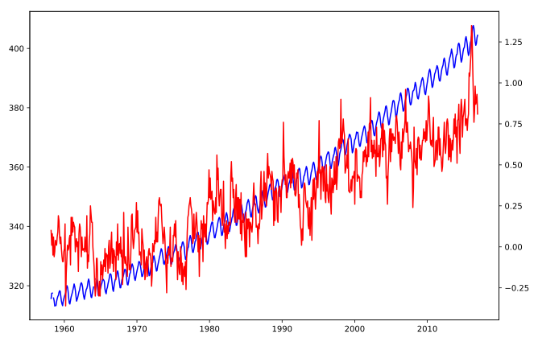

## Plotting two variables

If you want to plot two time-series variables that were recorded at the same times, you can add both of them to the same subplot.

If the variables have very different scales, you'll want to make sure that you plot them in different twin Axes objects. These objects can share one axis (for example, the time, or x-axis) while not sharing the other (the y-axis).

To create a twin Axes object that shares the x-axis, we use the `twinx` method.

In this exercise, you'll have access to a DataFrame that has the `climate_change` data loaded into it. This DataFrame was loaded with the `"date"` column set as a `DateTimeIndex`, and it has a column called `"co2"` with carbon dioxide measurements and a column called `"relative_temp"` with temperature measurements.

**Instructions**

* Use `plt.subplots` to create a Figure and Axes objects called `fig` and `ax`, respectively.
* Plot the carbon dioxide variable in blue using the Axes `plot` method.
* Use the Axes `twinx` method to create a twin Axes that shares the x-axis.
* Plot the relative temperature variable in the twin Axes using its `plot` method.

## Script
```
import matplotlib.pyplot as plt

# Initalize a Figure and Axes
fig, ax = plt.subplots()

# Plot the CO2 variable in blue
ax.plot(climate_change.index, climate_change['co2'], color='b')

# Create a twin Axes that shares the x-axis
ax2 = ax.twinx()

# Plot the relative temperature in red
ax2.plot(climate_change.index, climate_change['relative_temp'], color='r')

plt.show()
```

## Output
