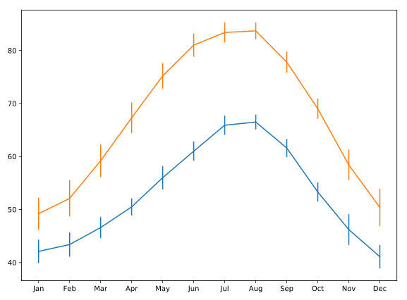

## Adding error-bars to a plot

Adding error-bars to a plot is done by using the `errorbars` method of the `Axes` object.

Here, you have two DataFrames loaded: `seattle_weather` has data about the weather in Seattle and `austin_weather` has data about the weather in Austin. Each DataFrame has a column `"MONTH"` that has the names of the months, a column `"MLY-TAVG-NORMAL"` that has the average temperature in each month and a column `"MLY-TAVG-STDDEV"` that has the standard deviation of the temperatures across years.

In the exercise, you will plot the mean temperature across months and add the standard deviation at each point as y errorbars.

**Instructions**

* Use the `ax.errorbar` method to add the Seattle data: the `"MONTH"` column as x values, the `"MLY-TAVG-NORMAL"` as `y` values and `"MLY-TAVG-STDDEV"` as `yerr` values.
* Add the Austin data: the `"MONTH"` column as x values, the `"MLY-TAVG-NORMAL"` as `y` values and `"MLY-TAVG-STDDEV"` as `yerr` values.
* Set the y-axis label as `"Temperature (Fahrenheit)"`.

## Script
```
fig, ax = plt.subplots()

# Add Seattle temperature data in each month with error bars
ax.errorbar(seattle_weather.MONTH, seattle_weather['MLY-TAVG-NORMAL'], yerr=seattle_weather['MLY-TAVG-STDDEV'])

# Add Austin temperature data in each month with error bars
ax.errorbar(austin_weather.MONTH, austin_weather['MLY-TAVG-NORMAL'], yerr=austin_weather['MLY-TAVG-STDDEV'])

# Set the y-axis label
ax.ylabel='Temperature (Fahrenheit)'

plt.show()
```

## Output
