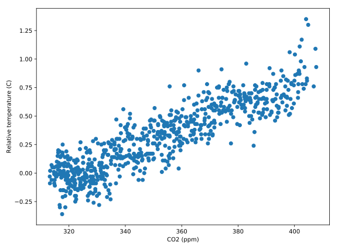

Simple scatter plot

Scatter are a bi-variate visualization technique. They plot each record in the data as a point. The location of each point is determined by the value of two variables: the first variable determines the distance along the x-axis and the second variable determines the height along the y-axis.

In this exercise, you will create a scatter plot of the `climate_change` data. This DataFrame, which is already loaded, has a column `"co2"` that indicates the measurements of carbon dioxide every month and another column, `"relative_temp"` that indicates the temperature measured at the same time.

**Instructions**

* Using the `ax.scatter` method, add the data to the plot: `"co2"` on the x-axis and `"relative_temp"` on the y-axis.
* Set the x-axis label to "CO2 (ppm)".
* Set the y-axis label to "Relative temperature (C)".

## Script
```
fig, ax = plt.subplots()

# Add data: "co2" on x-axis, "relative_temp" on y-axis
ax.scatter(climate_change.co2, climate_change.relative_temp)

# Set the x-axis label to "CO2 (ppm)"
ax.set_xlabel('CO2 (ppm)')

# Set the y-axis label to "Relative temperature (C)"
ax.set_ylabel('Relative temperature (C)')

plt.show()
```

## Output
